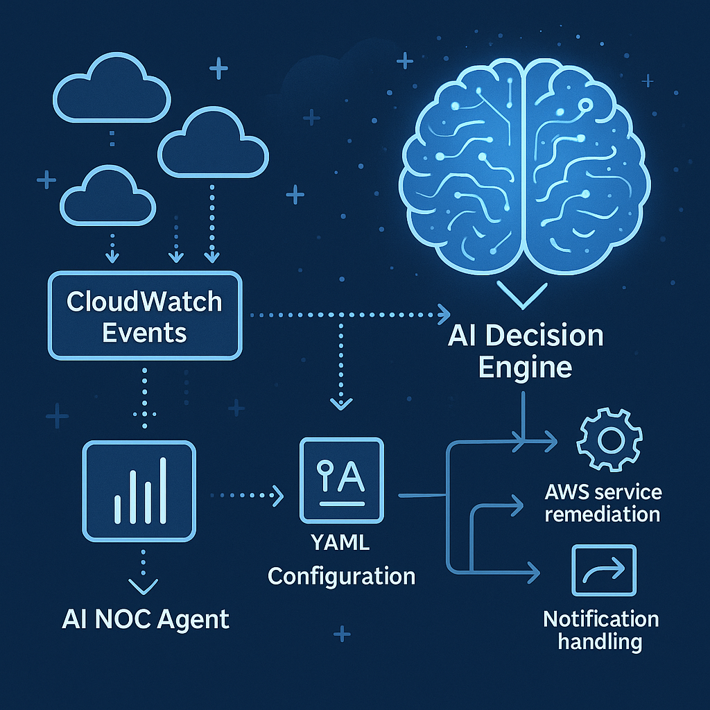
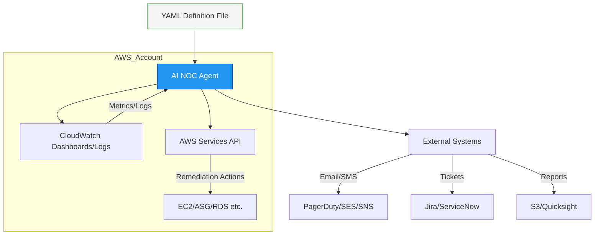
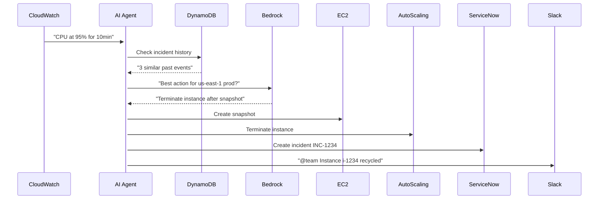

# CloudOpsAI - AI NOC Agent



[](https://sonarcloud.io/summary/new_code?id=fleXRPL_CloudOpsAI)
[](https://sonarcloud.io/summary/new_code?id=fleXRPL_CloudOpsAI)
[](https://sonarcloud.io/summary/new_code?id=fleXRPL_CloudOpsAI)
[](https://sonarcloud.io/summary/new_code?id=fleXRPL_CloudOpsAI)
[](https://sonarcloud.io/summary/new_code?id=fleXRPL_CloudOpsAI)
[](https://sonarcloud.io/summary/new_code?id=fleXRPL_CloudOpsAI)
[](https://sonarcloud.io/summary/new_code?id=fleXRPL_CloudOpsAI)
[](https://sonarcloud.io/summary/new_code?id=fleXRPL_CloudOpsAI)
[](https://sonarcloud.io/summary/new_code?id=fleXRPL_CloudOpsAI)
[](https://sonarcloud.io/summary/new_code?id=fleXRPL_CloudOpsAI)

## Overview

The AI NOC Agent is an innovative solution designed to transform traditional Network Operations Center (NOC) monitoring from a human-centric "eyes on glass" approach to an intelligent, automated system. This project emerged from our experience with traditional managed NOC services that, while effective, were costly and limited by human response times.

## Background

Traditional NOC operations typically involve:

- 24/7 staffing with multiple shifts of operators
- Manual monitoring of dashboards ("eyes on glass")
- Human interpretation of alerts and incidents
- Standard runbooks for remediation
- High operational costs ($500K-$1M+ annually)
- Average response times of 5-15 minutes

## Why AI NOC Agent?

### Cost Efficiency

- Reduces operational costs by 70-80% compared to traditional NOC services
- Eliminates the need for 24/7 human staffing
- Pay-per-use model for AI services

### Performance

- Sub-second response times to incidents
- Consistent application of remediation procedures
- Zero human-induced errors
- Learns from historical incidents

### Scalability

- Handles unlimited concurrent incidents
- Easily scales across multiple AWS accounts
- No degradation in performance during peak times

### Enhanced Capabilities

- Predictive incident detection
- Pattern recognition across historical data
- Automated root cause analysis
- Self-improving remediation strategies

## Command Line Interface

CloudOpsAI includes a powerful CLI for interacting with the system. The CLI allows you to:

- Monitor current alerts
- Review historical incidents
- Ask questions to the AI
- Get time-based summaries

For detailed CLI documentation and usage instructions, see [CLOUDOPSAI.md](CLOUDOPSAI.md).

## Comparison with Traditional NOC

| Aspect              | Traditional NOC           | AI NOC Agent       |
| ------------------- | ------------------------- | ------------------ |
| Response Time       | 5-15 minutes              | Sub-second         |
| Cost Structure      | Fixed costs (staffing)    | Pay-per-use        |
| Scalability         | Limited by staff          | Unlimited          |
| Coverage            | Limited by human capacity | Comprehensive      |
| Consistency         | Variable                  | 100% consistent    |
| Learning Capability | Manual knowledge transfer | Automated learning |
| Annual Cost         | $500K-$1M+                | $50K-$100K         |

---

### **AI NOC Agent Architecture**



---

### **Core Components**

#### 1. **YAML Configuration Engine**

```yaml
# Example remediation_actions.yaml
rules:
  - name: "HighCPU_Remediation"
    trigger:
      metric: "CPUUtilization"
      namespace: "AWS/EC2"
      threshold: 90
      duration: "5 minutes"
    actions:
      - type: "remediate"
        steps:
          - "aws autoscaling set-instance-protection --no-protected-from-scale-in"
          - "aws autoscaling terminate-instance-in-auto-scaling-group"
      - type: "notify"
        channel: "slack"
        message: "High CPU instance terminated: {{instance_id}}"

  - name: "RDSStorage_Alert"
    trigger:
      metric: "FreeStorageSpace"
      namespace: "AWS/RDS"
      threshold: 10 # GB
    actions:
      - type: "ticket"
        system: "servicenow"
        priority: "P2"
```

#### 2. **AI Decision Engine**

- **Inputs**: CloudWatch Metrics/Logs + YAML rules
- **Processing**:
  - Uses **Amazon Bedrock** (Anthropic Claude) to:
    - Interpret ambiguous alerts ("Is this a real incident?")
    - Suggest novel remediation steps not predefined in YAML
  - **Stateful tracking** using DynamoDB for incident timelines

#### 3. **Action Dispatcher**

| Action Type       | AWS Service Used           | Example                        |
| ----------------- | -------------------------- | ------------------------------ |
| Auto-remediation  | SSM Automation, Lambda     | Restart hung EC2 instance      |
| Notifications     | SNS, SES, Chime/Slack Bots | "High memory usage on prod-db" |
| Ticket Creation   | ServiceNow/Jira API        | Auto-P1 ticket for outage      |
| Report Generation | QuickSight, S3, Athena     | Weekly cost anomaly PDF        |

---

### **Implementation Steps**

1. **Deployment Framework**

   ```bash
   # CDK/Python example
   from aws_cdk import (
       aws_lambda as lambda_,
       aws_events as events
   )

   noc_agent = lambda_.Function(
       self, "NOCAgent",
       runtime=lambda_.Runtime.PYTHON_3_12,
       code=lambda_.Code.from_asset("ai_noc"),
       handler="agent.handler",
       environment={
           "CONFIG_S3_PATH": "s3://noc-configs/remediation_actions.yaml"
       }
   )

   events.Rule(
       self, "CloudWatchTrigger",
       event_pattern=events.EventPattern(
           source=["aws.cloudwatch"],
           detail_type=["CloudWatch Alarm State Change"]
       ),
       targets=[events.LambdaFunction(noc_agent)]
   )
   ```

2. **Key AWS Services**

   - **Monitoring**: CloudWatch Metrics/Logs, EventBridge
   - **AI/ML**: Bedrock (Claude), SageMaker (custom models)
   - **Actions**: Lambda, SSM, Step Functions
   - **State Management**: DynamoDB (incident history)

3. **Advanced Features**
   - **Predictive Scaling**: Forecasts traffic spikes using Lookout for Metrics
   - **Topology-Aware Remediation**: Uses AWS Config to understand resource relationships
   - **Cost-Safe Mode**: Auto-disables expensive actions in non-prod accounts

---

### **Why This Works**

1. **Declarative Configuration**  
   Ops teams define rules in YAML without coding.

2. **AI Augmentation**

   - Handles edge cases ("Is this disk fill pattern normal for Black Friday?")
   - Learns from past actions (DynamoDB audit log)

3. **Enterprise-Ready**

   - IAM role with least privilege (`noc-agent-role`)
   - Multi-account support via AWS Organizations

4. **Cost Effective**
   - Lambda: Only runs when needed
   - Bedrock: Pay-per-use AI

---

### **Example Workflow**


